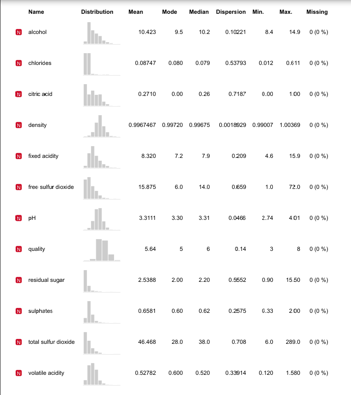
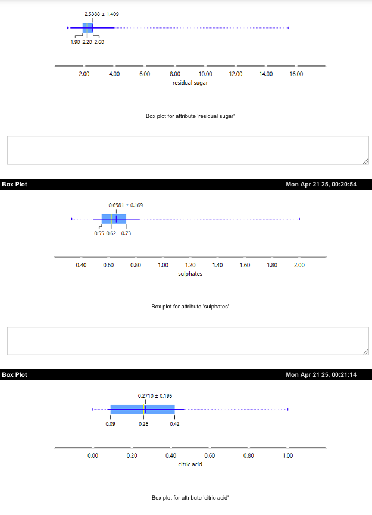
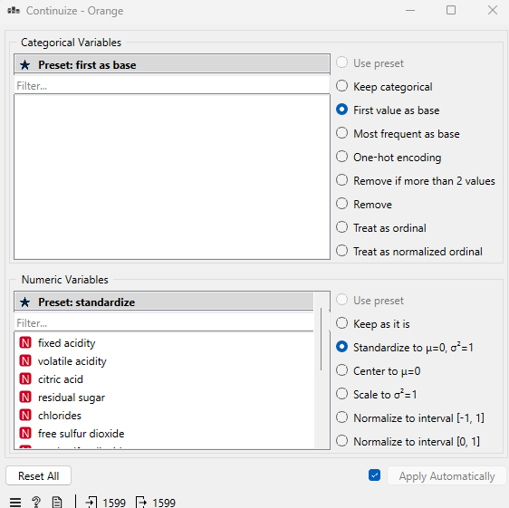
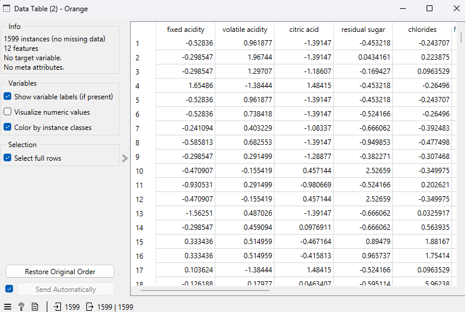
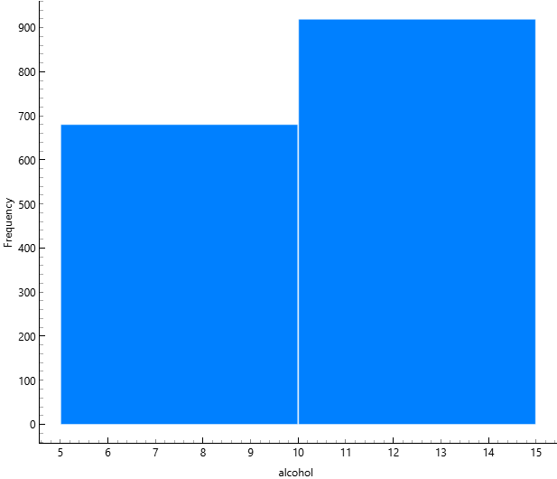
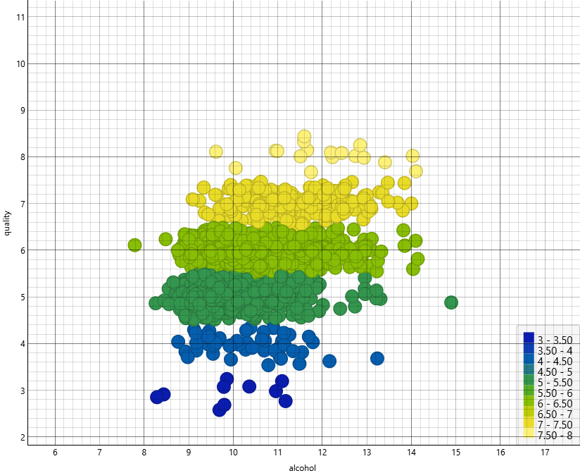
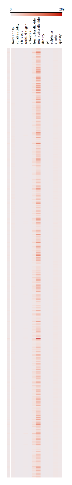
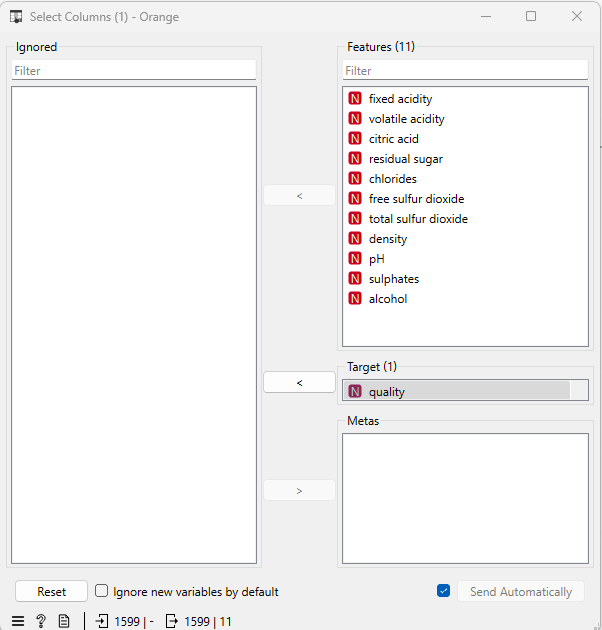
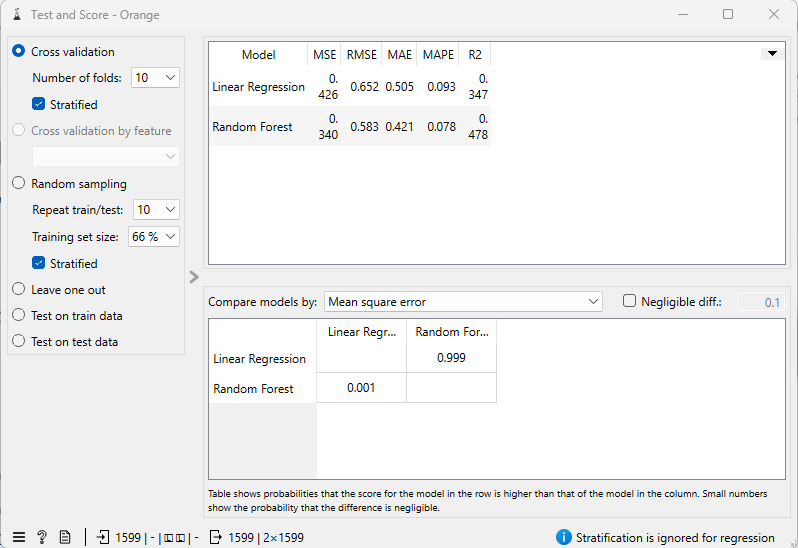

# YMT5270 Ara Sınav Projesi: Orange ile Veri Analizi ve Makine Öğrenmesi

## Öğrenci Bilgileri
- **Ad Soyad**: Nebahat Beyza Akkılıç
- **Öğrenci Numarası**: 241137102
- **E-posta**: 241137102@firat.edu.tr

## Proje Özeti
> Bu projede, şarap kalitesini tahmin etmeye yönelik bir makine öğrenmesi uygulaması gerçekleştirilmiştir. Kullanılan veri seti, UCI Machine Learning Repository'den alınan ve kırmızı şarapların kimyasal özelliklerini içeren **Wine Quality** veri setidir. Bu veri seti, 11 adet bağımsız değişken (örneğin: pH, alkol, sitrik asit, sülfür dioksit miktarı vb.) ve 0 ile 10 arasında değişen `quality` adında sayısal bir hedef değişkenden oluşmaktadır. Veri setinin yapısı nedeniyle analiz yöntemi olarak **regresyon** tercih edilmiştir. Bu çalışmada, **Linear Regression** ve **Random Forest** modelleri uygulanmış ve Orange Data Mining aracı kullanılarak modelleme süreci gerçekleştirilmiştir. Her iki model, 10 katlı çapraz doğrulama yöntemi ile test edilmiştir.
Sonuçlar, Random Forest algoritmasının Linear Regression’a göre daha başarılı olduğunu göstermektedir. Özellikle ortalama kare hata (MSE), ortalama mutlak hata (MAE) ve R-kare (R²) gibi metriklerde Random Forest daha düşük hata oranlarına ve daha yüksek başarı skoruna ulaşmıştır.
Bu proje, temel düzeyde regresyon problemleri üzerinde çalışmak isteyenler için uygun bir örnek teşkil etmektedir. Sonuçlar, kimyasal bileşenlerin şarap kalitesi üzerinde anlamlı bir etkisi olduğunu ve doğru model seçimi ile bu ilişkinin başarılı bir şekilde tahmin edilebileceğini göstermektedir.

## Veri Seti
### Veri Seti Bilgileri
- **Veri Seti Adı**: Wine Quality Data Set
- **Kaynak**: [*Wine Quality Data Set*](https://archive.ics.uci.edu/dataset/186/wine+quality)
- **Lisans**: P. Cortez, A. Cerdeira, F. Almeida, T. Matos, and J. Reis. "Wine Quality," UCI Machine Learning Repository, 2009. [Online]. Available: https://doi.org/10.24432/C56S3T.
- **Veri Seti Boyutu**: 1599 satır, 12 sütun

### Veri Seti Tanımı
*Veri, Portekiz'in Vinho Verde bölgesindeki şarap üreticilerinden elde edilmiştir. Kimyasal analizler laboratuvar ortamında gerçekleştirilmiştir. Kalite puanları, uzman tadımcıların subjektif değerlendirmeleri ile belirlenmiştir.*

⚠️ Olası Sınırlılıklar
- **Öznel Kalite Puanı:** `quality` değişkeni kişisel değerlendirmeye dayalıdır.
- **Sınıf Dengesizliği:** Bazı kalite puanlarının örnek sayısı düşüktür (örneğin kalite=3, kalite=9).
- **Tüm Öznitelikler Sayısal:** Kategorik değişken bulunmamaktadır.
- **Tek Tür Veri:** Sadece kırmızı şarap verilerini içermektedir.

### Öznitelik Açıklamaları
| Öznitelik Adı            | Veri Tipi | Açıklama                                                                 | Örnek Değer |
|--------------------------|-----------|--------------------------------------------------------------------------|-------------|
| `fixed acidity`          | Sayısal   | Sabit asitlik; şarapta çözünmüş temel asit miktarı (tartaric acid vb.)  | 7.4         |
| `volatile acidity`       | Sayısal   | Uçucu asitlik; yüksek değerler kötü tat ile ilişkilidir (asetik asit)   | 0.70        |
| `citric acid`            | Sayısal   | Sitrik asit oranı; şaraba tazelik ve asitlik dengesi katar               | 0.00        |
| `residual sugar`         | Sayısal   | Şeker oranı (g/lt); fermantasyon sonrası kalan şeker miktarı            | 1.9         |
| `chlorides`              | Sayısal   | Tuzluluk oranı (NaCl vs.); yüksek değerler kaliteyi düşürebilir         | 0.076       |
| `free sulfur dioxide`    | Sayısal   | Şarapta mikrobiyal büyümeyi engelleyen SO₂ miktarı                       | 11.0        |
| `total sulfur dioxide`   | Sayısal   | Serbest + bağlı sülfür dioksit toplamı                                   | 34.0        |
| `density`                | Sayısal   | Şarabın yoğunluğu (g/cm³)                                                | 0.9978      |
| `pH`                     | Sayısal   | Asitlik derecesi (0–14 arası)                                            | 3.51        |
| `sulphates`              | Sayısal   | Sülfat oranı; antiseptik özellik taşır, kalite ile pozitif ilişkili     | 0.56        |
| `alcohol`                | Sayısal   | Alkol oranı (% hacimsel)                                                 | 9.4         |
| `quality`                | Sayısal   | Tadım uzmanlarınca verilen kalite puanı (hedef değişken, 0–10 arası)     | 5           |
| ... | ... | ... | ... |

## Keşifsel Veri Analizi (Explanatory Data Analysis - EDA)
### Temel İstatistikler

Aşağıdaki görselde, veri setinde yer alan her özniteliğe ait temel istatistiksel bilgiler yer almaktadır:

> Bu tablo, her bir öznitelik için minimum, maksimum, ortalama (mean), medyan, mod, dağılım (dispersion) gibi istatistiksel değerleri göstermektedir. Ayrıca eksik veri oranları da görüntülenmektedir.

#### 📌 Öne Çıkan Gözlemler:

- **Eksik veri yoktur.** Tüm özniteliklerin eksik veri oranı %0’dır.
- **Alcohol** ortalaması 10.42, maksimum değeri ise 14.9’dur. Kaliteyle pozitif bir ilişki olabileceği düşünülmektedir.
- **Volatile acidity**, **citric acid** ve **sulphates** gibi bazı özniteliklerin dağılımı çarpıktır; bu, aykırı değer analizi yapmayı gerekli kılar.
- **Density**, çok küçük bir dağılıma sahip olup, oldukça homojen bir değişkendir.
- **Free sulfur dioxide** ve **total sulfur dioxide** değerleri oldukça değişken; maksimum değerleri sırasıyla 72 ve 289’dur. Bu değerler potansiyel aykırı değerleri işaret ediyor olabilir.
- **Quality** hedef değişkenimiz olup 3 ile 8 arasında değişmektedir. Ortalama kalite 5.64’tür. Bu, sınıflandırma için uygun bir yapı sunar.

### Veri Ön İşleme
- *Eksik verilerin tespiti*

    Veri setinde eksik değer bulunmamaktadır. Aşağıdaki görselde tüm özniteliklerin tam dolu olduğu görülmektedir:
    

- *Aykırı değerlerin tespiti*

    Box Plot kullanılarak yapılan analizde bazı özniteliklerde aykırı değerler gözlemlenmiştir. Özellikle 'residual sugar', 'total sulfur dioxide' ve 'citric acid' değişkenleri dikkat çekmektedir.
  
    

- *Veri normalizasyonu/standardizasyonu*

    Veri seti, farklı ölçeklerdeki özniteliklerin model performansını olumsuz etkilememesi için standart sapmaya göre normalize edilmiştir. Ve kategorik verilerin kodlanması bu veri seti sadece sayısal öznitelikler       içerdiğinden atlanmıştır.
    
    

### Görselleştirmeler

#### Görselleştirme 1: Alkol Dağılımı (Histogram)

> Bu görselleştirme, veri setinde bulunan şarapların alkol düzeylerinin dağılımını göstermektedir. Yüksek alkol seviyesine sahip örneklerin sayıca daha fazla olduğu gözlemlenmiştir. Bu durum, alkol düzeyinin şarap kalitesi üzerinde etkili bir faktör olabileceğini düşündürmektedir.

#### Görselleştirme 2: Alkol ve Kalite İlişkisi (Scatter Plot)

> Bu scatter plot, şaraplardaki alkol miktarı ile kalite puanı arasındaki ilişkiyi göstermektedir. Alkol miktarının artmasıyla birlikte kalite skorlarının da artma eğiliminde olduğu gözlemlenmiştir. Bu durum, alkol seviyesinin kaliteyi etkileyen önemli bir faktör olabileceğini düşündürmektedir. Renkler ile gösterilen pH seviyeleri ise tüm kalite gruplarında benzer bir dağılım göstermektedir.

### Öznitelik İlişkileri

> Bu görselleştirmede, Wine Quality veri setindeki özniteliklerin değer yoğunlukları incelenmiştir. Grafikteki her bir renk tonu, ilgili özniteliğin veri içindeki sıklığını temsil etmektedir. Koyu renklere sahip alanlar, daha sık gözlemlenen değerleri göstermektedir.

## Makine Öğrenmesi Uygulaması
### Kullanılan Yöntem

Bu projede, Wine Quality veri seti kullanılmıştır. Veri setindeki hedef değişken olan **quality** sayısal (numeric) bir değişken olduğu için **regresyon yöntemi** tercih edilmiştir. Amaç, şarapların kimyasal özelliklerine dayanarak kalite değerlerini tahmin etmektir. 

### Modeller ve Parametreler

Orange ile iki farklı regresyon modeli uygulanmıştır:

- **Linear Regression**: Parametre gerektirmeyen basit doğrusal model.
- **Random Forest**: Orange içindeki varsayılan ayarlarla çalıştırılmıştır.

Veri işleme adımlarında:
- `Select Columns` widget'ı kullanılarak `quality` hedef değişken olarak atanmıştır.
- Diğer kimyasal nitelikler (ör. alcohol, sulphates, pH vb.) özellik (feature) olarak belirlenmiştir.

  

### Model Değerlendirmesi

Aşağıda, her iki model için 10 katlı çapraz doğrulama ile elde edilen başarı metrikleri verilmiştir:

#### Metrikler
| Metrik | Linear Regression | Random Forest |
|--------|-------------------|----------------|
| MSE    | 0.426             | **0.340**      |
| RMSE   | 0.652             | **0.583**      |
| MAE    | 0.505             | **0.421**      |
| MAPE   | 0.093             | **0.078**      |
| R²     | 0.347             | **0.478**      |

### Sonuçların Yorumlanması

Random Forest modeli, tüm performans metriklerinde Linear Regression'a göre daha iyi sonuçlar vermiştir. Özellikle R² skorunun yüksek olması, modelin bağımsız değişkenlerle hedef değişken arasındaki ilişkiyi daha iyi yakaladığını göstermektedir.

**Modelin güçlü yönleri:**
- Random Forest doğrusal olmayan ilişkileri daha iyi öğrenebilir.
- Aşırı öğrenmeye (overfitting) karşı dirençlidir.

**Modelin zayıf yönleri:**
- Açıklanabilirlik düşüktür.
- Hesaplama maliyeti yüksektir.

**Alternatif modeller:**
- **XGBoost** veya **Gradient Boosting** gibi diğer ensemble yöntemleri denenebilir.
- Hiperparametre optimizasyonu yapılabilir.

## Orange İş Akışı

Aşağıda Orange'da oluşturulan iş akışının görseli yer almaktadır:

**İş akışı adımları:**
1. `File` widget'ı ile veri seti yüklendi.
2. `Select Columns` ile hedef ve özellik değişkenleri belirlendi.
3. `Linear Regression` ve `Random Forest` modelleri eklendi.
4. `Test and Score` ile modeller 10 katlı çapraz doğrulama ile değerlendirildi.

## Sonuç ve Öneriler

Bu çalışmada, Wine Quality veri seti üzerinde regresyon modelleri uygulanmıştır. Random Forest modeli, hata oranlarını düşürüp kaliteyi daha doğru tahmin ederek Linear Regression modeline göre üstün performans göstermiştir.

### Öneriler:
- Model performansı arttırmak için hiperparametre optimizasyonu yapılabilir.
- Diğer regresyon modelleri ile (SVR, Ridge, Lasso) karşılaştırmalar yapılabilir.
- Özellik mühendisliği ile modele yeni anlamlı değişkenler eklenebilir.

## Kaynaklar

1. ChatGPT
2. DeepSeek
3. https://archive.ics.uci.edu/ml/datasets/Wine+Quality
4. Orange Data Mining Documentation – https://orangedatamining.com
5. https://scikit-learn.org/stable/modules/ensemble.html#random-forests
6. Ufuk Çelik Adım Adım "Veri Madenciliği" 11 Orange 01 - https://youtu.be/6HSZ0qppFWw?si=8TJPNjJ01G10fxfc
7. Orange Data Mining Video Tutorials - https://www.youtube.com/c/OrangeDataMining

## Ekler
### Orange Proje Dosyası
> 
> [Proje_Dosyasi.ows](project/winequality.ows)

### Veri Seti Dosyası veya Bağlantısı
>
> [Wine Quality Veri Seti Bağlantısı](https://archive.ics.uci.edu/dataset/186/wine+quality)
