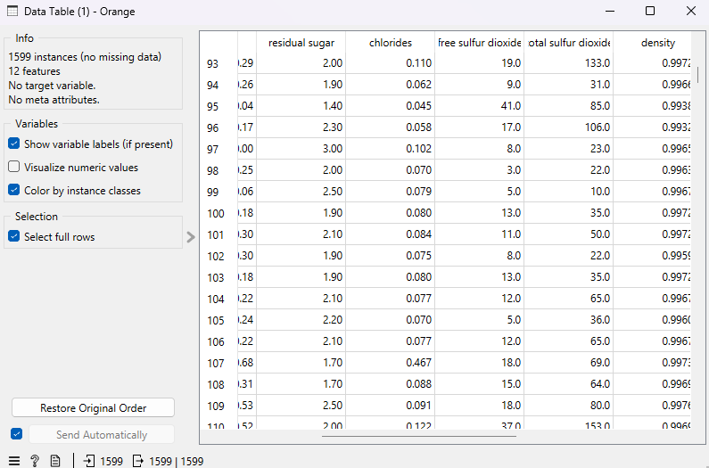

# YMT5270 Ara Sınav Projesi: Orange ile Veri Analizi ve Makine Öğrenmesi

## Öğrenci Bilgileri
- **Ad Soyad**: Nebahat Beyza Akkılıç
- **Öğrenci Numarası**: 241137102
- **E-posta**: 241137102@firat.edu.tr

## Proje Özeti
> *Bu bölümde projenizin genel bir özetini yazınız. Hangi veri setini neden seçtiğinizi, hangi analiz yöntemlerini uyguladığınızı ve genel sonuçlarınızı kısaca açıklayınız (150-250 kelime).*

## Veri Seti
### Veri Seti Bilgileri
- **Veri Seti Adı**: Wine Quality Data Set
- **Kaynak**: [*Wine Quality Data Set*](https://archive.ics.uci.edu/dataset/186/wine+quality)
- **Lisans**: P. Cortez, A. Cerdeira, F. Almeida, T. Matos, and J. Reis. "Wine Quality," UCI Machine Learning Repository, 2009. [Online]. Available: https://doi.org/10.24432/C56S3T.
- **Veri Seti Boyutu**: 1599 satır, 12 sütun

### Veri Seti Tanımı
*Veri, Portekiz'in Vinho Verde bölgesindeki şarap üreticilerinden elde edilmiştir. Kimyasal analizler laboratuvar ortamında gerçekleştirilmiştir. Kalite puanları, uzman tadımcıların subjektif değerlendirmeleri ile belirlenmiştir.*

⚠️ Olası Sınırlılıklar
- **Öznel Kalite Puanı:** `quality` değişkeni kişisel değerlendirmeye dayalıdır.
- **Sınıf Dengesizliği:** Bazı kalite puanlarının örnek sayısı düşüktür (örneğin kalite=3, kalite=9).
- **Tüm Öznitelikler Sayısal:** Kategorik değişken bulunmamaktadır.
- **Tek Tür Veri:** Sadece kırmızı şarap verilerini içermektedir.

### Öznitelik Açıklamaları
| Öznitelik Adı            | Veri Tipi | Açıklama                                                                 | Örnek Değer |
|--------------------------|-----------|--------------------------------------------------------------------------|-------------|
| `fixed acidity`          | Sayısal   | Sabit asitlik; şarapta çözünmüş temel asit miktarı (tartaric acid vb.)  | 7.4         |
| `volatile acidity`       | Sayısal   | Uçucu asitlik; yüksek değerler kötü tat ile ilişkilidir (asetik asit)   | 0.70        |
| `citric acid`            | Sayısal   | Sitrik asit oranı; şaraba tazelik ve asitlik dengesi katar               | 0.00        |
| `residual sugar`         | Sayısal   | Şeker oranı (g/lt); fermantasyon sonrası kalan şeker miktarı            | 1.9         |
| `chlorides`              | Sayısal   | Tuzluluk oranı (NaCl vs.); yüksek değerler kaliteyi düşürebilir         | 0.076       |
| `free sulfur dioxide`    | Sayısal   | Şarapta mikrobiyal büyümeyi engelleyen SO₂ miktarı                       | 11.0        |
| `total sulfur dioxide`   | Sayısal   | Serbest + bağlı sülfür dioksit toplamı                                   | 34.0        |
| `density`                | Sayısal   | Şarabın yoğunluğu (g/cm³)                                                | 0.9978      |
| `pH`                     | Sayısal   | Asitlik derecesi (0–14 arası)                                            | 3.51        |
| `sulphates`              | Sayısal   | Sülfat oranı; antiseptik özellik taşır, kalite ile pozitif ilişkili     | 0.56        |
| `alcohol`                | Sayısal   | Alkol oranı (% hacimsel)                                                 | 9.4         |
| `quality`                | Sayısal   | Tadım uzmanlarınca verilen kalite puanı (hedef değişken, 0–10 arası)     | 5           |
| ... | ... | ... | ... |

## Keşifsel Veri Analizi (Explanatory Data Analysis - EDA)
### Temel İstatistikler

Aşağıdaki görselde, veri setinde yer alan her özniteliğe ait temel istatistiksel bilgiler yer almaktadır:

> Bu tablo, her bir öznitelik için minimum, maksimum, ortalama (mean), medyan, mod, dağılım (dispersion) gibi istatistiksel değerleri göstermektedir. Ayrıca eksik veri oranları da görüntülenmektedir.

#### 📌 Öne Çıkan Gözlemler:

- **Eksik veri yoktur.** Tüm özniteliklerin eksik veri oranı %0’dır.
- **Alcohol** ortalaması 10.42, maksimum değeri ise 14.9’dur. Kaliteyle pozitif bir ilişki olabileceği düşünülmektedir.
- **Volatile acidity**, **citric acid** ve **sulphates** gibi bazı özniteliklerin dağılımı çarpıktır; bu, aykırı değer analizi yapmayı gerekli kılar.
- **Density**, çok küçük bir dağılıma sahip olup, oldukça homojen bir değişkendir.
- **Free sulfur dioxide** ve **total sulfur dioxide** değerleri oldukça değişken; maksimum değerleri sırasıyla 72 ve 289’dur. Bu değerler potansiyel aykırı değerleri işaret ediyor olabilir.
- **Quality** hedef değişkenimiz olup 3 ile 8 arasında değişmektedir. Ortalama kalite 5.64’tür. Bu, sınıflandırma için uygun bir yapı sunar.

### Veri Ön İşleme
- *Eksik verilerin tespiti*

    Veri setinde eksik değer bulunmamaktadır. Aşağıdaki görselde tüm özniteliklerin tam dolu olduğu görülmektedir:
    

- *Aykırı değerlerin tespiti*

    Box Plot kullanılarak yapılan analizde bazı özniteliklerde aykırı değerler gözlemlenmiştir. Özellikle 'residual sugar', 'total sulfur dioxide' ve 'citric acid' değişkenleri dikkat çekmektedir.
  
    

- *Veri normalizasyonu/standardizasyonu*

    Veri seti, farklı ölçeklerdeki özniteliklerin model performansını olumsuz etkilememesi için standart sapmaya göre normalize edilmiştir. Ve kategorik verilerin kodlanması bu veri seti sadece sayısal öznitelikler       içerdiğinden atlanmıştır.
    
    

### Görselleştirmeler

#### Görselleştirme 1: Alkol Dağılımı (Histogram)

> Bu görselleştirme, veri setinde bulunan şarapların alkol düzeylerinin dağılımını göstermektedir. Yüksek alkol seviyesine sahip örneklerin sayıca daha fazla olduğu gözlemlenmiştir. Bu durum, alkol düzeyinin şarap kalitesi üzerinde etkili bir faktör olabileceğini düşündürmektedir.

#### Görselleştirme 2: Alkol ve Kalite İlişkisi (Scatter Plot)

> Bu scatter plot, şaraplardaki alkol miktarı ile kalite puanı arasındaki ilişkiyi göstermektedir. Alkol miktarının artmasıyla birlikte kalite skorlarının da artma eğiliminde olduğu gözlemlenmiştir. Bu durum, alkol seviyesinin kaliteyi etkileyen önemli bir faktör olabileceğini düşündürmektedir. Renkler ile gösterilen pH seviyeleri ise tüm kalite gruplarında benzer bir dağılım göstermektedir.

### Öznitelik İlişkileri

> Bu görselleştirmede, Wine Quality veri setindeki özniteliklerin değer yoğunlukları incelenmiştir. Grafikteki her bir renk tonu, ilgili özniteliğin veri içindeki sıklığını temsil etmektedir. Koyu renklere sahip alanlar, daha sık gözlemlenen değerleri göstermektedir.

## Makine Öğrenmesi Uygulaması
### Kullanılan Yöntem
> *Veri setinize uyguladığınız makine öğrenmesi yöntemini (sınıflandırma, regresyon veya kümeleme) belirtiniz ve neden bu yöntemi seçtiğinizi açıklayınız.*

### Modeller ve Parametreler
> *Denediğiniz modelleri ve kullandığınız parametreleri açıklayınız. Orange'da yapılandırdığınız widget ayarlarını ekran görüntüleri ile destekleyebilirsiniz.*

### Model Değerlendirmesi
> *Uyguladığınız modelin performansını değerlendiriniz. Kullandığınız değerlendirme metriklerini açıklayınız.*

#### Metrikler
| Metrik | Değer |
|--------|-------|
| Örnek Metrik 1 | 0.85 |
| Örnek Metrik 2 | 0.78 |
| ... | ... |

### Sonuçların Yorumlanması
> *Elde ettiğiniz sonuçları detaylı bir şekilde yorumlayınız. Modelin güçlü ve zayıf yönleri nelerdir? Başka hangi modeller denenebilirdi?*

## Orange İş Akışı
> *Orange ile oluşturduğunuz iş akışı görselini buraya ekleyiniz. İş akışınızın adımlarını kısaca açıklayınız.*

## Sonuç ve Öneriler
> *Projenizin genel bir değerlendirmesini yapınız. Elde ettiğiniz sonuçlar hakkında çıkarımlarınızı ve gelecek çalışmalar için önerilerinizi yazınız.*

## Kaynaklar
> *Proje boyunca yararlandığınız kaynakları (makaleler, web siteleri, videolar, vb.) buraya ekleyiniz.*

1. Kaynak 1
2. Kaynak 2
3. ...

## Ekler
### Orange Proje Dosyası
> *Orange proje dosyanızı (.ows) bu repoya yükleyiniz ve buradan referans veriniz.*
> 
> [Proje_Dosyasi.ows](proje_dosyasi.ows)

### Veri Seti Dosyası veya Bağlantısı
> *Kullandığınız veri setini bu repoya yükleyebilir veya bağlantısını burada paylaşabilirsiniz.*
>
> [Veri_Seti.csv](veri_seti.csv) veya [Veri Seti Bağlantısı](https://ornek-veri-seti-baglantisi.com)
